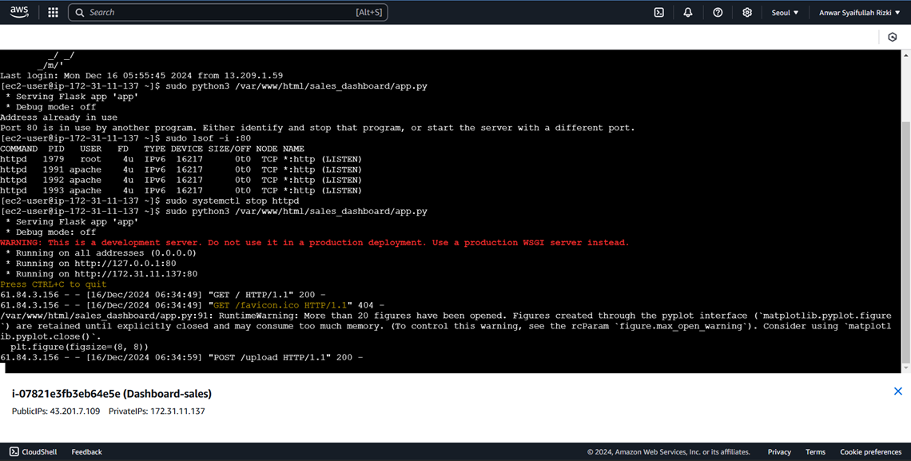
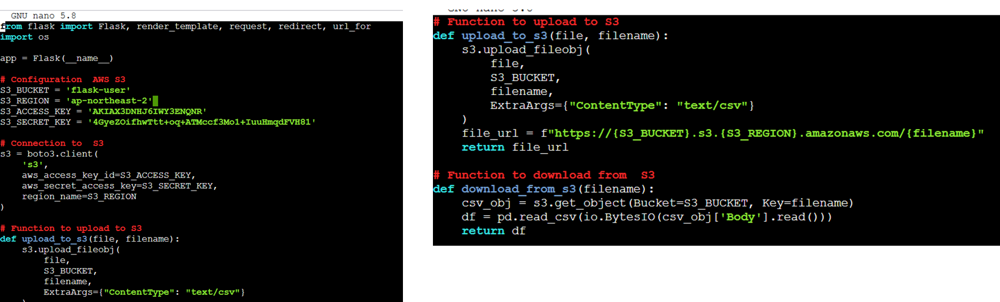
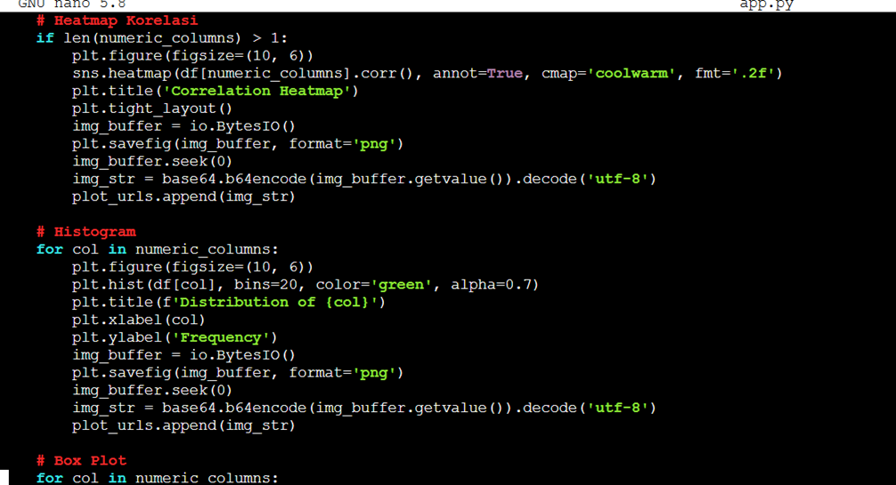
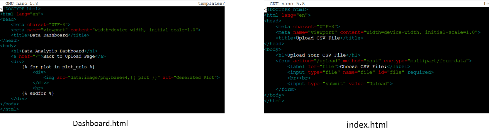
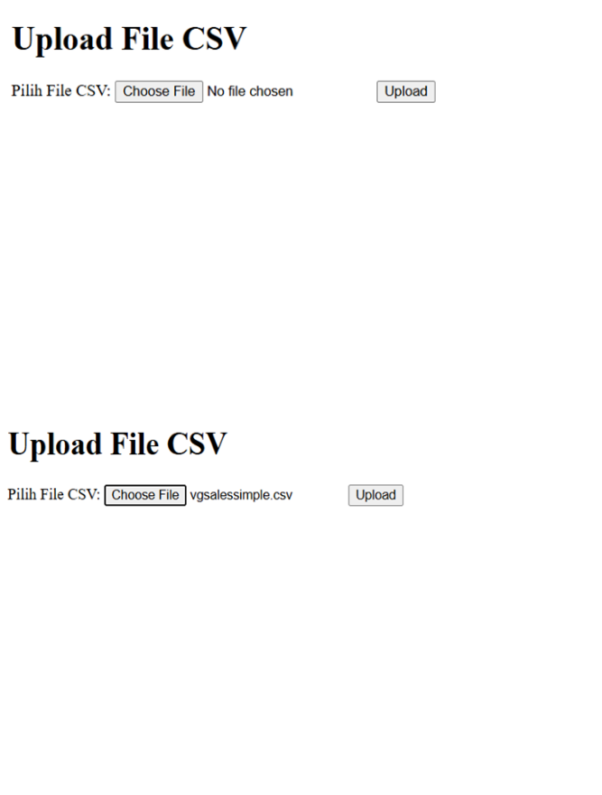
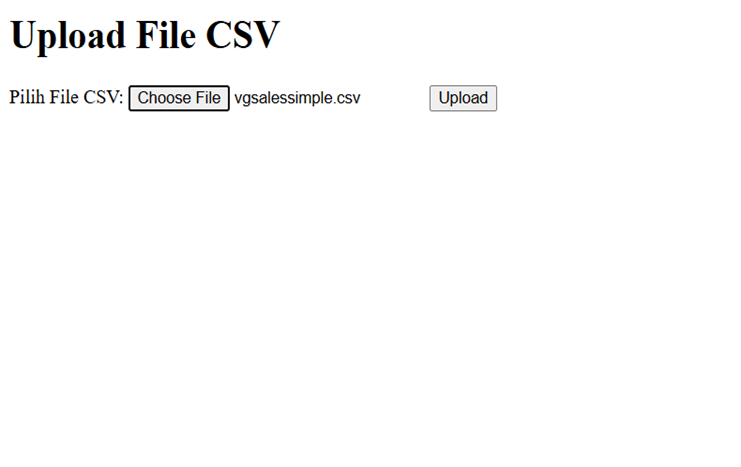
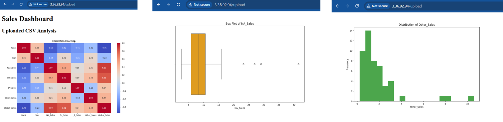
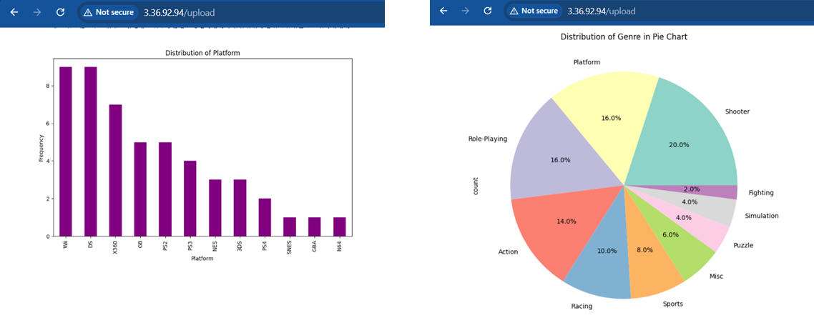

# AWS-Based Data Visualization Dashboard

## Project Overview
✨ This project is a **Flask-based web application** designed to **upload, store, and visualize CSV data** using **AWS services**. It uses **AWS EC2** for hosting and **AWS S3** for file storage, featuring interactive visualizations like **histograms**, **boxplots**, **correlation heatmaps**, and **pie chart** 🖼️—powered by Python libraries.

## Features 🚀
- **📂 CSV Upload and Storage**: Easily upload CSV files to an **S3 bucket**.
- **📊 Interactive Data Visualization**: Generate:
  - Histograms 📈
  - Boxplots 📦
  - Correlation heatmaps 🔥
  - Pie Chart🥧
- **🌐 Web Interface**: User-friendly HTML templates for file uploads and viewing dashboards.

## Architecture 🏗️
The project leverages **AWS infrastructure**:
- **💻 EC2 Instance**: Hosts the Flask web app.
- **🗂️ S3 Bucket**: Securely stores uploaded CSV files.
- **🔐 IAM Policies**: Configured to follow the **principle of least privilege** for secure access.

### AWS Configuration ⚙️
- **EC2**:
  - **AMI**: Amazon Linux 2 🐧
  - **Instance Type**: t2.micro (Free tier eligible) 💸
  - **Inbound Rules**: Enabled HTTP (port 80) and SSH (port 22) 🔓
- **S3**:
  - Created a private bucket for CSV storage 🔒.
  - Configured bucket permissions via IAM policies:
    - `s3:PutObject`: Upload files to S3.
    - `s3:GetObject`: Read files for processing.

### Technologies Used 🛠️
- **Backend**: Flask (Python) 🐍
- **Data Processing**: Pandas, Matplotlib 📊
- **Frontend**: HTML templates (Dashboard and Index pages) 🌐
- **Cloud**: AWS EC2, S3 ☁️

## Project Files 📂
- `app.py`: Flask application code.
- `templates/`:
  - `index.html`: Main page for file upload.
  - `dashboard.html`: Displays visualizations.
- Sample CSV files for testing.

## Screenshots 📸
### Backend

### Frontend

### Dashboard Features:

## Key Takeaways 💡
- **AWS Infrastructure**: Configured and managed services like EC2 and S3.
- **Data Processing**: Used Pandas for analysis and Matplotlib for visualization.
- **Secure Access**: Implemented least privilege principles in IAM policies.

## Future Improvements 🌟
- **Automation**: Integrate AWS Lambda for automatic data processing 🤖.
- **Data Storage**: Use AWS RDS or DynamoDB for structured data storage 🗄️.
- **Enhanced UX**: Improve dashboard interactivity and optimize performance for large datasets ⚡.

## Contact 📬
For questions or collaboration, feel free to reach out:
- **Email**: anwars.rizki@gmail.com
- **LinkedIn**: [Anwar Rizki](https://www.linkedin.com/in/anwar-sr/)
